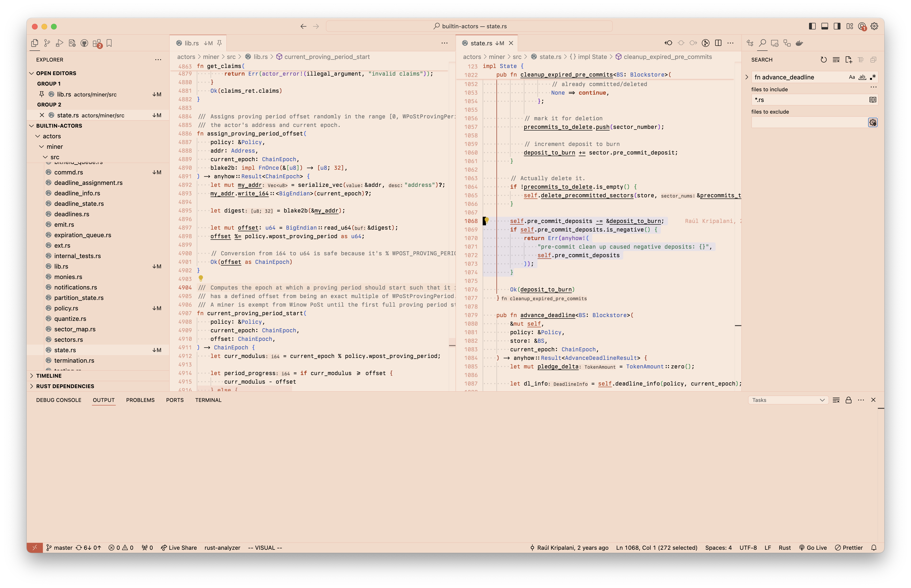

# Boavista VSCode Theme

_The light theme trying to keep your eyes from burning!_

Currently, Boavista officialy supports the following languages:

- Rust
- Python
- Markdown
- JSON
- YAML

> Originally based on [Pen Paper Coffee](https://github.com/nylki/pen-paper-coffee-vscode).
